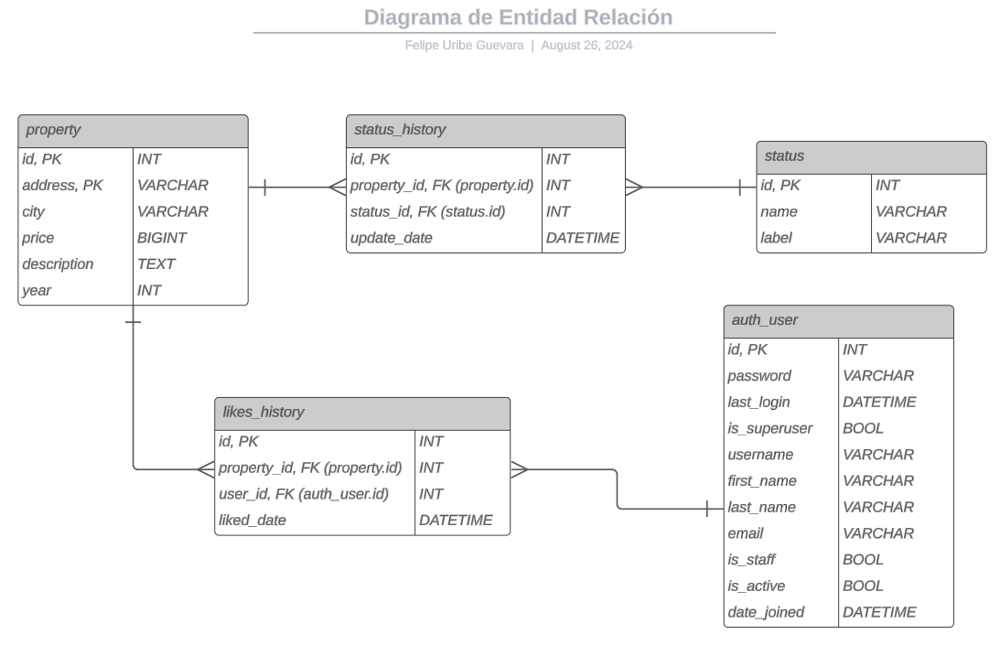
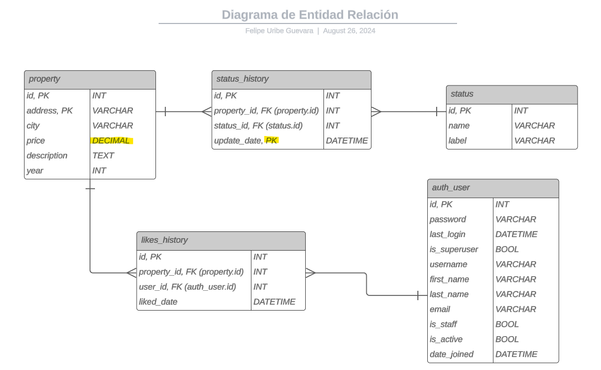

# Prueba Técnica - Habi

## Descripción del Proyecto

Este proyecto tiene como finalidad desarrollar dos microservicios: uno funcional para la consulta de inmuebles 
disponibles y vendidos, y otro conceptual para gestionar los "me gusta" de los usuarios en los inmuebles. 
El objetivo es crear una herramienta robusta y escalable que permita a los usuarios de Habi buscar inmuebles 
aplicando diferentes filtros y registrar sus preferencias a través de 
un sistema de favoritos.


## Tecnologías Utilizadas

- **Lenguaje de Programación:** Python 3.12.2
- **Base de Datos:** MySQL
- **Gestión de Dependencias:** `pip`
- **Conección con la Base de Datos** `mysql-connector-python`
- **Gestión de variables de entorno** `python-dotenv`
- **Pruebas Unitarias:** `unittest`
- **Control de Versiones:** Git & GitHub
- **Entorno de Desarrollo:** PyCharm

## Enfoque de Desarrollo

### Servicio de Consulta

1. **Análisis y Diseño:**
   - Los usuarios únicamente pueden consultar inmuebles con los estados: `pre_venta`, `en_venta`, y `vendido`.
   - Diseñar una consulta SQL eficiente que recupere los inmuebles según los filtros aplicados.
   - Implementar filtros por año de construcción, ciudad, y estado.
   - Construir un microservicio que pueda ser consumido por una arquitectura REST.
   - Crear un archivo JSON que simule los datos que se esperan recibir desde el front-end con los filtros aplicados 
   por los usuarios.

2. **Implementación:**
   - Implementación de la query: 
     1. Extraer el estado más reciente.
     2. Identificar el nombre del estado cruzando 'status_history' con 'status'.
     3. Obtener los datos que se muestran al usuario cruzando con la tabla de propiedades.
     4. Descartar los estados inválidos.
     5. Eliminar los datos inconsistentes.
     6. Implementar filtros por año de construcción, ciudad, y estado.
   - Desarrollar la lógica backend para manejar las consultas y los filtros. Para asemejar el comportamiento de un
   microservicio, se establecerá un controlador para capturar excepciones en la estructura de los datos y ejecutar 
   el servicio dependiendo de la demanda solicitada. Ej: (**_Obtener Inmuebles_**)
   - Los datos que vienen del front serán similares a lo que recibe el parámetro _**"event"**_ del 
   las funciones **_"lambda"_** de AWS (**[Event parameter](https://aws-lambda-for-python-developers.readthedocs.io/en/latest/02_event_and_context/)**)

3. **Pruebas:**
   - Implementar pruebas unitarias para garantizar que las consultas y filtros funcionen correctamente.

### Servicio de "Me gusta"

1. **Diseño Conceptual:**
   - Diseñar un diagrama de Entidad-Relación (ERD) para extender el modelo de la base de datos y soportar la 
   funcionalidad de "me gusta".
   - El diagrama debe reflejar cómo se almacenarán los "me gusta" y cómo se relacionan con los usuarios y los inmuebles.

2. **Implementación SQL:**
   - Escribir el código SQL necesario para extender el modelo de la base de datos con las tablas y relaciones 
   requeridas.

### Pruebas y Documentación

- **Pruebas Unitarias:** 
   - Asegurarse de que cada funcionalidad esté cubierta por pruebas unitarias, validando los resultados esperados 
  y manejando errores.

- **Documentación:** 
   - Documentar detalladamente el código, el diagrama ERD y las decisiones de diseño tomadas durante el desarrollo.

## Desarrollo servicio "Me gusta"

Se establece una relación de muchos a muchos representada por una tabla de relación
llama 'likes_history' la cual tendrá la siguiente estructura:
```text
    id INT PRIMARY KEY
    property_id INT FOREIGN KEY
    user_id INT FOREIGN KEY
    liked_date DATETIME
```
De este modo se consigue almacenar la cantidad de likes por propiedad y las propiedades favoritas de un usuario
así mismo si que necesitara se podrían realizar métricas teniendo en cuenta las propiedades favoritas de la última 
semana, mes o cualquier instante del tiempo.

El modelo entidad relación que extiende el modelo inicial es el siguiente:



Para llevar a cabo la implementación de esta nueva tabla de relación se propone el siguiente código SQL

### Creación de la tabla
```sql
CREATE TABLE likes_history (
 id INT PRIMARY KEY AUTO_INCREMENT,
 property_id INT,
 user_id INT,
 liked_date DATETIME,
 FOREIGN KEY (property_id) REFERENCES property(id),
 FOREIGN KEY (user_id) REFERENCES auth_user(id)
);
```
### Posibles servicios a implementar
1. Servicio "Agregar a favoritos/Me gusta":
    ```sql
    INSERT INTO likes_history 
       (
        property_id, 
        user_id, 
        liked_date 
       ) 
    VALUES
       (
        {property_id_value}, 
        {user_id_value}, 
        {liked_date_value}   
       );
   ```
   
2. Servicio publicaciones favoritas:
    ```sql
    SELECT u.id, 
       u.username, 
       p.address, 
       p.city
    FROM likes_history lh
    JOIN auth_user u
    ON lh.user_id = u.id
    JOIN property p 
    ON lh.property_id = p.id
    WHERE u.username = {username_value}
    GROUP BY lh.user_id, lh.property_id
   ```

3. Cantidad de likes por propiedad:
    ```sql
    SELECT p.id, 
       p.address, 
       p.city, 
       count(lh.property_id) as amount_of_likes
    FROM likes_history lh
    JOIN property p 
    ON lh.property_id = p.id
    GROUP BY lh.property_id;
   ```
   A la anterior se le podría agregar una cláusula where con el objetivo de obtener solo
    una propiedad.

En resumen, la implementación de la tabla de relación para los usuarios y las propiedades 
permite desarrollar distintos servicios asociados al sistema de favoritos.

## ¿Que mejoraría la estructura actual de la base de datos?

A términos generales el modelo de la base de datos esta bien relacionado y esto no permite gran margen de mejora, 
sin embargo, para el tipo de datos que existen en la base de datos veo dos posibles mejoras:

1. Llave primaria compuesta entre el property id y la fecha de actualización. Esto facilita las consultas de
historial por propiedad.
2. El valor del precio para las propiedades debería ser de tipo decimal pues los valores monetarios no suelen ser 
exactos la mayoría del tiempo.

### El modelo con los cambios se vería de la siguiente manera:



Existen factores adicionales a tener en cuenta para replantear la estructura de la base de datos, por ejemplo, las
condiciones del negocio, si llegase a ser necesario la estructura podría cambiar de manera tal que no se necesite una 
base de datos relacional.

## JSON (Sample request)

```json
{
  "requestContext": {
    "resourcePath": "/{endpoint_operation_value}",
    "httpMethod": "{http_method_value}"
  },
  "headers": {
    "accept": "*/*",
    "Host": "{client_address_value}",
    "User-Agent": "{browsers_version}",
    "Authorization": "Token {token_value}"
  },
  "queryStringParameters": {
    "construction_year": "{year_value}",
    "city": "{city_value}",
    "status": "{satus_name_value}"
  },
  "pathParameters": {
    "operation": "{endpoint_operation_value}"
  },
  "body": "{body_object_value}"
}
```
Como fue explicado en el apartado de implementación se utliza el objeto "**_event_**" que recibe la función 
"_**lambda_handler**_" en AWS pues es un ejemplo real de como podría llegar los datos siendo esta función invocada
por un servicio como **_API Gateway_** el cual puede ser perfectamente utilizado para una arquitectura 
de microservicios.

### Atributos del objeto

- **endpoint_operation_value**: Cadena de caracteres que representa la operación a ejecutar. 
Ej: (create_property, get_properties...) 
- **http_method_value**: Cadena de caracteres que representa el método http, este tiene un valor acorde a la 
operación; "POST" (Crear valores), "GET" (Recuperar valores), etc.
- **client_address_value**: Cadena de caracteres que representa la dirección del cliente desde donde 
fue ejecutada la petición.
- **browsers_version**: Es una cadena de caracteres que indica el navegador y la versión del mismo.
- **token_value**: Es el valor encriptado con el algoritmo SHA256 del la frase secreta de autenticación.
- **year_value**: Es un parámetro de consulta el cual hace referencia al año de construcción del
inmueble (**_no es requerido_**).
- **city**: Es un parámetro de consulta el cual hace referencia al año de construcción del inmueble (**_no es requerido_**).
- **status**: Es un parámetro de consulta el cual hace referencia al estado del inmueble (**_no es requerido_**).
- **body_object_value**: Es un objeto el cual representa los valores que se desean envíar al servidor desde el cliente.

## Instalación y Ejecución

1. Clonar el repositorio:
   ```bash
   git clone https://github.com/FelipeUribe81/Habi-Technical-Assessment.git
   cd Habi-Technical-Assessment
   ```

2. Instalar dependencias:
   ```bash
   pip install requirements.txt
   ```
   
3. Configurar las variables de entorno:
   - Crear un archivo .env en la raiz del proyecto.
   - Agregar la configuración de la base de datos:
   ```bash
   DB_HOST=xxxxxxxxxx
   DB_PORT=xxxx
   DB_USER=xxxxxx
   DB_PASSWORD=xxxxxx
   DB_DATABASE=xxxxxxx
   ```
   - Agregar la configuración de la applicación:
   ```bash
   APP_SECRET=xxxxxx
   APP_USER=xxxxxxx
   APP_PASSWORD=xxxxxx
   ```
   
4. Ejecutar la aplicación:
   ```bash
    python .\main.py
   ```
   
5. Ejecutar las pruebas:
   ```bash
    python -m unittest .\test\real_estate\test_main_services.py
   ```
